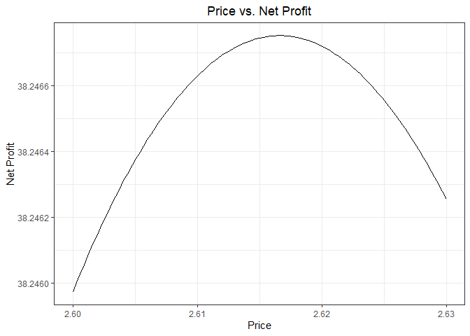

Exercise 1
================

## Flights at ABIA

The Austin-Bergstrom International Airport is among the busiest of
airports in Texas, so it is inevitable that there will be possible
delays when flying to and from it. The goal of the following figures is
to provide information that can help one decide the optimal day and time
to fly in or out of ABIA, as well as the airline carrier to fly with.

 

The following two figures show the optimal times throughout the day to
arrive and depart from ABIA to minimize delays.

The above figure shows average delay throughout the day for flights
departing from ABIA. It appears that departing either early in the
morning or late at night would be ideal to minimize delays. It also
appears that one should avoid departing around noon and especially
around the evening if they wish to minimize delays.

 

In this second figure above, the average delay for flights arriving at
ABIA is shown. Similarly to the departures, delay is minimized early in
the morning. However, it appears that delay shows a steady increase
throughout the day peaking in the hours of night.

 

Knowing what time of day is ideal for arriving or departing from ABIA is
only part of the story, so the next figure will show the optimal days
during the year to fly in and out of ABIA to minimize delays.

As shown above, the average daily delay in 2008 at ABIA fluctuated quite
a bit day to day, but the highest delays were seen in mid March, late
November, and late December. It is highly likely the reason for these
increases in delays is a result of the heavy amount of travel that
happens during these times, as they align with Spring Break,
Thanksgiving Break, and Christmas respectively.

 

Finally, in addition to choosing the optimal day and time to fly in and
out of ABIA, choice of airline carrier influences the travelling
experience.

From these two figures, it is clear which airline carriers should be
flown with caution as they either have higher cancellations or higher
delays. For the ideal flying experience, choosing a carrier with less
delays and a low previous cancellation percentage would be recommended.

## Regression Practice

1)  What creatinine clearance rate should we expect, on average, for a
    55-year-old?

We should expect a creatinine clearance rate of 113.723 mL/minute for
the average 55 year-old.

 

2)  How does creatinine clearance rate change with age?

The rate at which the creatinine clearance rate changes is about -0.620
mL/minute each year one gets older.

 

3)  Whose creatinine clearance rate is healthier (higher) for their age:
    a 40-year-old with a rate of 135, or a 60-year-old with a rate of
    112?

The creatinine clearance rate of the 40 year-old is healthier as it is
11.980 mL/minute above the average while it is 1.376 mL/minute for the
60 year-old.

## Green Buildings

I am initially skeptical of the analysis of the “data guru”, mainly
because of how simple it is.

From the above plot, the analyst’s use of the median rent for the green
buildings and the non-rated buildings is justified because of the
extreme positive skew shown in both. I also confirmed that the
difference in the medians is indeed $2.60, with green buildings having
the higher median. However, I believe that using the medians of the
building categories as a whole ignores the cluster sampling method that
was used to obtain this data. Clusters can vary greatly in their traits,
so I think it would be more appropriate to take them into account in the
analysis.

 

Looking now at the difference between the mean and median rents of
individual clusters shows a heavy concentration around 0. The reason I
use this metric is because it can be used to determine whether or not
the differences are skewed or more symmetric. Because most of the
differences are close to 0, I believe that the individuals clusters are
much less skewed than the whole dataset shown before.

 

As I decided before, the non-rated buildings rent distribution for each
individual cluster is mostly symmetric. Therefore, using the mean would
be just as admissible as using the median.  
Part of this dataset is the cluster’s mean rent, a metric that stands
out to me as important. The cluster’s mean rent is a further
generalization of the sampled non-rated mean for each cluster that was
calculated earlier. Because of this, I feel that it is safe to treat the
cluster mean rent as relatively symmetric also. As a result, I decided
to plot the differences between each cluster’s green building rent and
mean cluster rent. As seen above in the two visualizations of the same
data, the distribution of these differences is heavily positively skewed
again. Importantly, the boxplot shows that the median using this
interpretation of the data is $2.1, significantly less than the
analyst’s calculation.

 

In conclusion, I would be skeptical of the analysis done by the “data
guru”. The influence of external factors from cluster to cluster I
believe leads to greater nuances that were not addressed by the analyst.
I believe that more analysis should be done into the differences between
the green and non-certified buildings to decide whether or not a
green-building is worth investing in from an economic perspective. From
my analysis of parts of the data, I believe that the benefits of
green-building investment are not as good as they may seem on the
surface level.

## Milk Prices

In this scenario, we are asked to find the optimal price to sell units
of milk in order to maximize profit. This requires finding quantity Q as
a function of price P, since net profit N is based on both of these
variables.

Looking at the plot of the milk sales data above, the relationship
appears to be a power law. Therefore, we should convert both the x and y
axes with the log function.

 

As expected, applying the log function on both axes of the previous plot
yields a new plot that appears to show a negative linear relationship.
With this, we can apply OLS to find a linear equation to fit this data.

 

Shown here is the previous plot with the linear regression line added.

 

Now, using the coefficients yielded from OLS on the previous plot, the
new regression curve can be calculated for the original data. Shown
above is the plot of the original data with the regression curve
following a power law relationship.

 

Now that we have a function for Q in terms of P, we can plug that into
the equation for N which is shown in the graph above. For per-unit cost
C we used $1.

 

Zooming in on the graph, we see that the price that yields the maximum
net profit of about 38.25% is approximately $2.62.
