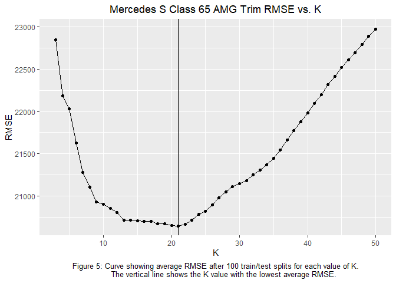
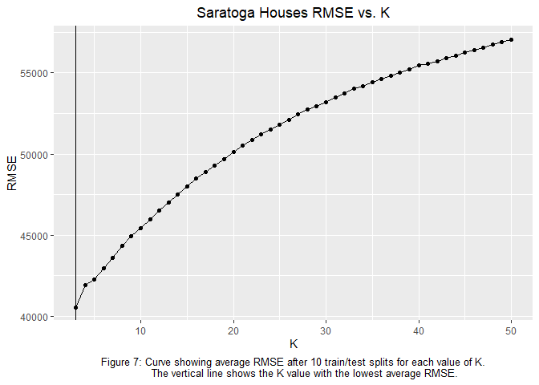

Exercise 2
================

## KNN Practice

Mercedes S Class vehicles cover a wide range of sub-models, from large
luxury sedans to high-performance sports cars. Our goal is to hone in on
two specific trim levels for these vehicles, 350 and 65AMG, and attempt
to build a predictive model using K-nearest neighbors (KNN) for their
price based on their mileage.

 

 

Figures 1 and 2 above show the distributions of price vs. mileage for
the two different trim levels. As expected, there is a clear negative
relationship between price and mileage, which makes sense as cars with
higher mileage are more likely used and therefore cheaper than brand new
cars. Of greater interest is the almost complete absence of any points
in Figure 1 in the 25,000 - 35,000 price range. Making price predictions
here could be problematic with KNN because all the closest neighbors
aren’t that close in reality.

 

Now that we’ve seen the data, it is time to run KNN on the two data
sets. Of upmost importance in KNN is choosing the optimal value for K to
fit the data. Therefore, values of K starting from 3 and onward were
tested on multiple train/test data set splits, recording the average
root mean squared error (RMSE) for each K. From there, the K value that
yielded the lowest average RMSE was chosen as the optimal K and used to
create a model for obtaining price from mileage.

 

 

<table class="table" style="margin-left: auto; margin-right: auto;">

<caption>

Table 1: RMSE of Optimal Fit

</caption>

<thead>

<tr>

<th style="text-align:left;">

</th>

<th style="text-align:right;">

RMSE ($)

</th>

</tr>

</thead>

<tbody>

<tr>

<td style="text-align:left;">

350

</td>

<td style="text-align:right;">

9979.792

</td>

</tr>

<tr>

<td style="text-align:left;">

65AMG

</td>

<td style="text-align:right;">

20647.073

</td>

</tr>

</tbody>

</table>

Using the optimal values of K, the models fit the two graphs quite well.
Looking at Figures 3 and 5, it is clear that there is a pretty wide
range of near optimal K values for the 65AMG trim level, while the range
for the 350 trim level is more narrow. Outside of the range though, the
65AMG trim level experiences a steep increase in RMSE compared to the
350 trim level which increases more steadily. Additionally, the 65AMG
trim level has a slightly larger optimal K value than the 350 trim
level. This could possibly be a result of the difference in spread of
the two different distributions as seen in Figures 1 and 2 or 4 and 6,
with the 65AMG having more spread out points than the 350. This could
possibly lead to more neighbors being needed in creating the optimal
model. Regardless, the difference in optimal K values is not that large,
and both trims ended up having an optimal K neither extremely small nor
large that fit their data well.

 

## Saratoga House Prices

There are many different factors to take into account when assessing the
value of a house, so attempting to predict the market value of houses
will require the use of powerful modeling methods. Using the Saratoga,
NY data set of house prices, the goal is to combine human intuition and
modeling methods to produce a more robust predictive model for the
housing market.

 

The baseline model that will be used to assess the performance of
potential models is a rather simple, but decently performing linear
model using several of the main features contained within the data set
as seen in Table 2 below. By calculating the RMSE on train/test splits
for new models compared to the baseline, we can explicitly track their
improvement.

| Table 2 - Baseline Model Features |                    |           |
| --------------------------------- | ------------------ | --------- |
| Lot Size (acres)                  | Living Area (sqft) | Bedrooms  |
| Age                               | % College Educated | Bathrooms |
| Fireplaces                        | Rooms              | Heating   |
| Fuel                              | Central Air        |           |

My first approach at improving the baseline model was based on intution,
simply adding main features and interactions between features that I
felt would be important in driving house prices. This worked decently
well, leading to mild performance improvements. However, later
approaches using forward selection, step selection, and KNN on the data
set generated models that showed massive gains in performance that made
my “hand-built” model pale in comparison.

| Table 3 - Additions in “Hand-Built” Model | : means interactions   |                         |
| ----------------------------------------- | ---------------------- | ----------------------- |
| Waterfront                                | Age:Living Area        | Living Area:Central Air |
| Living Area:Heating                       | Living Area:Fuel       | Fuel:Central Air        |
| Age:Central Air                           | Living Area:Fireplaces | Rooms:Heating           |
| Bedrooms:Fuel                             | Living Area:Rooms      | Bedrooms:Bathrooms      |

<table class="table" style="margin-left: auto; margin-right: auto;">

<caption>

Table 4: The performance gain of each model with respect to the baseline
model measured by the difference in RMSE values

</caption>

<thead>

<tr>

<th style="text-align:left;">

</th>

<th style="text-align:right;">

Average Model RMSE

</th>

<th style="text-align:right;">

Improvement from Base Model

</th>

</tr>

</thead>

<tbody>

<tr>

<td style="text-align:left;">

Base Model

</td>

<td style="text-align:right;">

66234.43

</td>

<td style="text-align:right;">

0.00

</td>

</tr>

<tr>

<td style="text-align:left;">

Hand-Built Model

</td>

<td style="text-align:right;">

63074.14

</td>

<td style="text-align:right;">

3160.30

</td>

</tr>

<tr>

<td style="text-align:left;">

Forward Selection Model

</td>

<td style="text-align:right;">

58204.90

</td>

<td style="text-align:right;">

8029.53

</td>

</tr>

<tr>

<td style="text-align:left;">

Step Selection Model

</td>

<td style="text-align:right;">

57261.45

</td>

<td style="text-align:right;">

8972.98

</td>

</tr>

<tr>

<td style="text-align:left;">

KNN Model

</td>

<td style="text-align:right;">

39729.88

</td>

<td style="text-align:right;">

26504.56

</td>

</tr>

</tbody>

</table>

As shown both by Figure 8 and Table 4, the clear winner in terms of
model performance is the KNN model using the optimal values of k = 3.
Though their performance was not as great as the KNN model, the other
three models each help give insight into the nature of the data set and
the general housing market. For example, the forward selection and step
selection models, which incrementally improve a model by adding (and in
the case of step selection, possibly removing) features and
interactions, can be useful for potentially highlighting important
relationships in the data that might not be easy to notice at the
surface level. Despite their end products typically leading to a model
that is very difficult to interpret, I found myself looking at the
progression of models in the forward selection and step selection to
help fine tune my “hand-built” model. When it comes to the “hand-built”
model, its importance lies not in the mild performance gains, but in its
simple interpretability. Out of the total features and interactions
added (seen in Table 3), including main features such as the property
being on a waterfront and interactions between living area and presence
of central air-conditioning showed to be strong influences on the model
and on house price. The “hand-built” model’s gains in performance
confirm some of the relatively intuitive ideas that price is influenced
by features and interactions like these (being on a waterfront would
likely increase prices and central air-conditioning would be much more
valuable and important in larger living spaces).

 

In conclusion, for the best predictions of the market value for houses,
the KNN model showed to be by-and-large the most effective and is the
one that should be used with performance in mind. However, the other
models should not be totally disregarded for they have their own
importance outside of strict ability to perform.

 

## Predicting When Articles Go Viral

Having an article go viral is a big deal, as it means spreading the
message of the article to a far-reaching audience. Mashable, who wants
to build a model to determine whether an article goes viral or not,
would benefit greatly from this as they would be able to likely
capitalize on it and have more viral posts. They would be able to
predict whether or not the articles they write would go viral. More
importantly however, an exemplary model would demystify the
characteristics of an article that make it more likely to go viral.

 

As the data set we are going to use to make these predictions consists
of a hefty 39,797 online articles published on Mashable during 2013 and
2014, with each entry consisting of 38 different features about the
article, I found it necessary to clean up the data set a bit to make it
more manageable. My method of cleaning up the data set was by condensing
down the number of variables, taking similar variables, like the 7 for
each day of the week an article could have been published, and
aggregating them. Additionally, I removed the url variable as it is
meaningless to our analysis and added the viral variable based on
Mashable’s judgement that a viral article has greater than 1400 shares.

 

Table 5 - Complete List of Variable Changes in Cleaning Data Set

| Deletions                        | Additions      |
| -------------------------------- | -------------- |
| url                              | viral          |
| data\_channel\_is\_lifestyle     | news\_channel  |
| data\_channel\_is\_entertainment |                |
| data\_channel\_is\_bus           |                |
| data\_channel\_is\_socmed        |                |
| data\_channel\_is\_tech          |                |
| data\_channel\_is\_world         |                |
| weekday\_is\_monday              | day\_published |
| weekday\_is\_tuesday             |                |
| weekday\_is\_wednesday           |                |
| weekday\_is\_thursday            |                |
| weekday\_is\_friday              |                |
| weekday\_is\_saturday            |                |
| weekday\_is\_sunday              |                |

 

There are two options on how to approach this problem, both of which
will be done to compare the outcomes. The first option is doing a
regression on the data set in order to build a predictive model for the
values of shares. Then, predictions from this model can be thresholded
where the article is predicted to go viral if the predicted value for
shares is greater than 1400. The second option is doing the reverse,
thresholding the data such that there is the binary viral (yes or no)
feature now, and then performing classification to build a model that
predicts if an article will go viral or not.

 

Our workhorse modeling method for both of these approaches will be KNN.
Unfortunately, because of the sheer number of features, even in the
processed version of the data set, it is unfeasible in both space and
time to do KNN regression on all the features. Therefore, I built my own
model to run through KNN regression that uses the features from the data
set that I believe would have the most influence on the share count. For
example, I included title\_subjectivity because I would think that posts
with a higher subjectivity in their title would get shared more often.
My complete choice of model is in Table 6. Additionally, to measure the
performance of the models, a good null model is necessary. Upon
examination of the data set, it appears that a little over half of the
articles are not viral, so a null model that predicts all articles to be
not viral would have an error rate of a little under half (see Table 7).

 

| Table 6 - Complete List of Features in KNN Regression Model |                  |
| ----------------------------------------------------------- | ---------------- |
| news\_channel                                               | num\_keywords    |
| title\_sentiment\_polarity                                  | num\_hrefs       |
| title\_subjectivity                                         | num\_self\_hrefs |
| avg\_negative\_polarity                                     | days\_published  |
| self\_reference\_avg\_sharess                               | n\_tokens\_title |

<table class="table" style="margin-left: auto; margin-right: auto;">

<caption>

Table 7 - Null model should always predict not viral because it is more
frequent

</caption>

<thead>

<tr>

<th style="text-align:left;">

</th>

<th style="text-align:right;">

Proportion

</th>

</tr>

</thead>

<tbody>

<tr>

<td style="text-align:left;">

Not Viral

</td>

<td style="text-align:right;">

0.5065584

</td>

</tr>

<tr>

<td style="text-align:left;">

Viral

</td>

<td style="text-align:right;">

0.4934416

</td>

</tr>

</tbody>

</table>

 

First is the KNN regression model, which predicts the shares of a news
article. This prediction is then thresholded and compared against the
actual viral status to determine the error rates.

<table class="table" style="margin-left: auto; margin-right: auto;">

<caption>

Table 8: Confusion matrix for KNN regression model with horizontal
predicted values and vertical actual values.

</caption>

<thead>

<tr>

<th style="text-align:left;">

</th>

<th style="text-align:right;">

0

</th>

<th style="text-align:right;">

1

</th>

</tr>

</thead>

<tbody>

<tr>

<td style="text-align:left;">

0

</td>

<td style="text-align:right;">

888

</td>

<td style="text-align:right;">

3088

</td>

</tr>

<tr>

<td style="text-align:left;">

1

</td>

<td style="text-align:right;">

480

</td>

<td style="text-align:right;">

3473

</td>

</tr>

</tbody>

</table>

<table class="table" style="margin-left: auto; margin-right: auto;">

<caption>

Table 9: KNN regression model performance metrics.

</caption>

<tbody>

<tr>

<td style="text-align:left;">

Overall Error Rate

</td>

<td style="text-align:right;">

0.4507895

</td>

</tr>

<tr>

<td style="text-align:left;">

True Positive Rate

</td>

<td style="text-align:right;">

0.8929323

</td>

</tr>

<tr>

<td style="text-align:left;">

False Positive Rate

</td>

<td style="text-align:right;">

0.7847501

</td>

</tr>

</tbody>

</table>

The KNN regression model with k = 3 performs decently well compared to
the null model, having an overall error rate 0.0426521 lower than the
null model. It seems that the KNN regression model predicts higher
shares than the actual share value, as seen by the high true positive
and false positive rates. The model just seems to predict that articles
will go viral very often, which is a bias that has to be taken into
account, despite the low value of K.

 

Next is the KNN classification model, which predicts if an article will
go viral directly. This is done by thresholding the data first and then
doing the classification of the data using KNN. Again, because of time
and space constraints, the list of features I chose is very sparse
(Table 10), which impacts the accuracy of the classification negatively.
The computational explosion that KNN has is an unfortunate drawback of
this powerful modeling method.

 

| Table 10 - Complete List of Features in KNN Classification Model |               |
| ---------------------------------------------------------------- | ------------- |
| title\_subjectivity                                              | num\_keywords |
| avg\_negative\_polarity                                          | online\_news  |

<table class="table" style="margin-left: auto; margin-right: auto;">

<caption>

Table 11: Confusion matrix for KNN classification model with horizontal
predicted values and vertical actual values.

</caption>

<thead>

<tr>

<th style="text-align:left;">

</th>

<th style="text-align:right;">

0

</th>

<th style="text-align:right;">

1

</th>

</tr>

</thead>

<tbody>

<tr>

<td style="text-align:left;">

0

</td>

<td style="text-align:right;">

2206

</td>

<td style="text-align:right;">

1797

</td>

</tr>

<tr>

<td style="text-align:left;">

1

</td>

<td style="text-align:right;">

1991

</td>

<td style="text-align:right;">

1935

</td>

</tr>

</tbody>

</table>

<table class="table" style="margin-left: auto; margin-right: auto;">

<caption>

Table 12: KNN classification model performance metrics.

</caption>

<tbody>

<tr>

<td style="text-align:left;">

Overall Error Rate

</td>

<td style="text-align:right;">

0.4730231

</td>

</tr>

<tr>

<td style="text-align:left;">

True Positive Rate

</td>

<td style="text-align:right;">

0.4856531

</td>

</tr>

<tr>

<td style="text-align:left;">

False Positive Rate

</td>

<td style="text-align:right;">

0.4326031

</td>

</tr>

</tbody>

</table>

The KNN classification model with k = 101 does not perform as well
compared to the null model as the regression model did, having an
overall error rate 0.0204186 lower than the null model. Unlike the KNN
regression model, the KNN classification model had true and false
positive rates that were on the underside of 0.5. Looking at the
confusion matrix in Table 11, the model has nearly equal proportions in
all four cells. A possible reason why this model underperformed was both
because the features of its underlying model were not as strong, and
because calculating the optimal K value requires too much time to
feasibly do.

 

Though these models did not give us significant improvements in
classification accuracy compared to the null model, I believe we still
learned a little about what features might improve an article’s chance
of reaching the threshold to be viral. The model that was built for the
KNN regression (Table 6) was able to improve the accuracy by 4-6% on
average, indicating that those features should be having some effect on
the shares an article gets. When it comes to which model, the regression
or the classification, performed better, they can not be fairly compared
because the features they were using were different because of time and
space constraints. However, intuitively, I would believe that the
regression first and threshold second paradigm would have better
performance because thresholding first causes the classification to be
on the basis of a binary decision, viral or not viral. With regression,
there is much more possibility for details to be included as
classification as viral simply required shares to be above the
threshold. In the end, it turns out deciding whether or not an article
will go viral based on its features is much more complicated and
difficult than it seems, but these KNN models were a starting point at
attempting to learn more about the nature of viral posts on Mashable.
