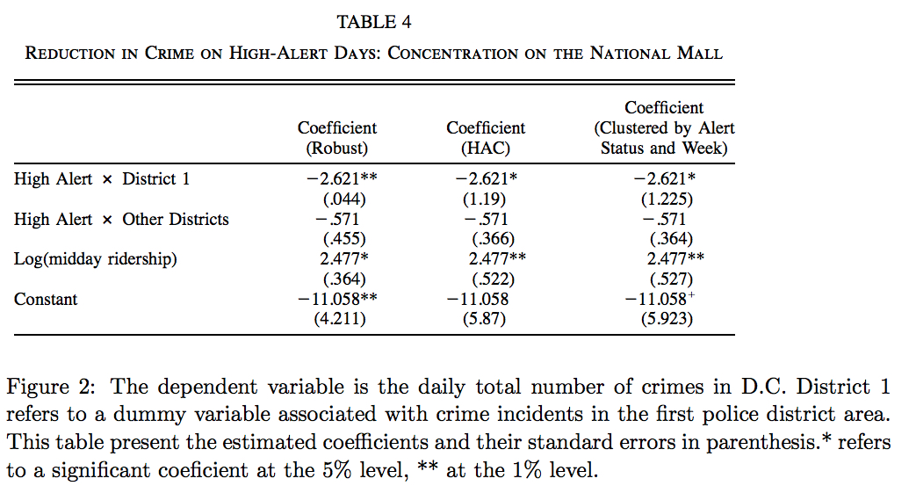

```{r setup, include = FALSE}
knitr::opts_chunk$set(echo = TRUE)
```

```{r libraries, include = FALSE}
library(tidyverse)
library(ggplot2)
library(mosaic)
library(foreach)
library(gamlr)
library(LICORS)
library(cluster)
library(corrplot)
library(factoextra)
library(gridExtra)
```

## Predictive Model Building

```{r, include = FALSE}
set.seed(7)

gb = read.csv("greenbuildings.csv")
summary(gb)

# Remove extraneous and redundant varaibles, as well as NA entries
gb = select(gb, - c(CS_PropertyID, LEED, Energystar, cd_total_07, hd_total07))
gb = na.omit(gb)

# Treat cluster like a factor though they are numbered
gb$cluster = as.factor(gb$cluster)
```

The price of housing is complex, influenced by many features specific to the property itself, as well as features from the surrounding envinronment. However, building a predictive model for price is useful, because a good model would help give agents and potential clients an estimate of the price of new or unpriced properties based on their features.

<p>&nbsp;</p>

Using the data on 7,894 commercial rental properties from across the United States, we will attempt to build a predictive model of rent based on several different features, such as age of the property or its status as a green building. 

```{r fig.align = 'center', echo = FALSE, warning = FALSE, message = FALSE}
# Rent is positively skewed, so we should regress on the log of it
qplot(log(Rent), data = gb) +
  labs(title = "Plot of log(Rent)",
       caption = "Figure 1: Histogram of the rent of 7,894 commercial rental properties
       on the log scale to normalize the otherwise positively skewed data.") +
  theme(plot.title = element_text(hjust = 0.5),
        plot.caption = element_text(size = 10, hjust = 0.5))
```

When building the model, log(rent) will be predicted as rent is highly positively skewed in the data. This transformation with the log function normalizes the rent which improves the effectiveness of the regression methods. A basic exploratory linear regression model of rent on green rating alone produces a model that says on average, the rental income per square foot is 9% higher for a green certified building compared to a normal building. However, this model fails to capture the effect of other features that could influence rent, so a more complex model is needed to more accurately capture the impact of green certification on rent holding other features constant.

<p>&nbsp;</p>

To build a more complex predictive model for rent, I have chosen a set of main effects from the data's many different features that appear to be related to rent graphically. Additionally, I have narrowed down the set to features that I believe intuitively would be critical in predicting the rent of a property accurately. The main effects I have chosen for building my model include green rating, age, renovation status, class_a classification, and whether utilities are included or not in the rent.

```{r fig.align = 'center', echo = FALSE, warning = FALSE, message = FALSE}
# Incredibly basic model and results
lm = lm(log(Rent) ~ green_rating, data = gb)
# coef(lm)

# Now to choose other main effects

# Lots of cluster level differences in rent
clust_samples = sample(levels(gb$cluster), 10)

p1 = ggplot(filter(gb, cluster %in% clust_samples)) +
  geom_boxplot(mapping = aes(x = cluster, y = log(Rent))) +
  labs(title = "Plot of Clusters on log(Rent)",
       x = "Cluster",
       caption = "Figure 2: Above is a grouped boxplot showing cluster level
       differences in rent of 10 different clusters sampled from the data. A
       cluster consists of a green building and other buildings surrounding it
       within a quarter-mile radius. Below are 4 other plots showing the effects
       of other features on rent. For the categorical features, 0 = No 1 = Yes.") +
  coord_flip() +
  theme(plot.title = element_text(hjust = 0.5),
        plot.caption = element_text(size = 10, hjust = 0.5),
        axis.text.y = element_text(size = 4))
p1

# age and rent
p2 = qplot(age, log(Rent), data = gb, geom = "point") +
  labs(title = "Plot of Age on log(Rent)",
       x = "Age") +
  theme(plot.title = element_text(hjust = 0.5),
        plot.caption = element_text(size = 10, hjust = 0.5))

# renovated and rent
p3 = qplot(factor(renovated), log(Rent), data = gb, geom = "boxplot") +
  labs(title = "Renovation Status on log(Rent)",
       x = "Renovation Status") +
  theme(plot.title = element_text(hjust = 0.5),
        plot.caption = element_text(size = 10, hjust = 0.5))

# class_a and rent
p4 = qplot(factor(class_a), log(Rent), data = gb, geom = "boxplot") +
  labs(title = "Class A Status on log(Rent)",
       x = "Class A Status") +
  theme(plot.title = element_text(hjust = 0.5),
        plot.caption = element_text(size = 10, hjust = 0.5))

# net and rent
p5 = qplot(factor(net), log(Rent), data = gb, geom = "boxplot") +
  labs(title = "Included Utilities on log(Rent)",
       x = "Included Utilities") +
  theme(plot.title = element_text(hjust = 0.5),
        plot.caption = element_text(size = 10, hjust = 0.5))

grid.arrange(p2, p3, p4, p5, ncol = 2)
```

Now that a set of main effects has been chosen, I will fit a lasso regression over all the features in the data, except for a few features that I deemed redundant, such as two features that specified which type of green certification a building received. The reason I believe that a lasso regression is appropriate for this situation is because there are many features that could potentially predict price, but I am not sure if including them would fit the model to noise, or improve its accuracy. By using lasso regression, redundant factors can be selected by shrinking their coefficients to 0, leaving only the relevant features in the model. The lasso regression predicts rent and includes all the features of the data as well as interactions between clusters and the main effects I highlighted earlier as predictors. I will not penalize the main effects in my lasso regression model, as I am fairly confident that they are good predictors for rent from the analysis earlier.

```{r fig.align = 'center', echo = FALSE, warning = FALSE, message = FALSE}
# Now run a lasso regression over all the effects
x_gb = sparse.model.matrix(~ green_rating + age + renovated + class_a + 
                             + net + cluster + class_b + amenities + size +
                             empl_gr + leasing_rate + stories + amenities +
                             total_dd_07 + Precipitation + Gas_Costs +
                             Electricity_Costs + cluster_rent + cluster:age +
                             cluster:renovated + cluster:class_a + cluster:net, 
                           data = gb)[, -1]
y_gb = log(gb$Rent)

set.seed(7)

lasso1 = cv.gamlr(x_gb, y_gb, free = 1:5)
# plot(lasso1)

# Coefficients of main effects
head(coef(lasso1))

# Number of coefficients in the model that are nonzero
# colSums(coef(lasso1) == 0)
```

Out of the 3447 coefficients in the lasso regression model handling all the features in the data as well as many interactions, 44 of them ending up being non-zero and used in predicting rent. Above are the results from the lasso regression, showing the first 5 coefficients for the unpenalized main effects that I chose. From this more complex model, we can conclude that on average, the rental income per square foot is 2.9% higher for a green certified building compared to a normal building holding other features constant. While this isn't as much of a difference compared to the first model, 2.9% is still a pretty significant difference and should be kept in mind by those looking into green buildings. In conclusion, lasso regression helped create a pretty good predictive model for rent from data that consisted of many noisy features and interactions, helping us hone in on the specific features and interactions that are the most useful in predicting the rent of a property.

<p>&nbsp;</p>

## What Causes What?

1. Why can’t I just get data from a few different cities and run the regression of “Crime” on “Police” to understand how more cops in the streets affect crime? (“Crime” refers to some measure of crime rate and “Police” measures the number of cops in a city.)\

Finding a causal relationship between crime rate and number of cops in a city is not as simple as sampling data from a few different cities and running a regression to predict "Crime" based on "Police". First, cities with a high crime rate are likely to employ a larger police force. Additionally, expectation or observation that crime rates are rising in a city would lead the jurisdictions to increase the size of their police forces. Therefore, it can be said that variations in crime causes variations in police presence, but it is difficult to prove the opposite.\
Additionally, in experimental studies, randomization and controlling for the effects of confounding variables are both important methods for reducing bias and providing more reliable estimates. Different cities have different situations, and these hidden factors could potentially have an effect on crime rate independent of police force. It is important these are controlled to isolate the effect of police force size on crime rate.

2. How were the researchers from UPenn able to isolate this effect? Briefly describe their approach and discuss their result in the “Table 2” below, from the researchers' paper.


The researchers from UPenn were able to isolate the effect of size of police force on crime rate by focusing on crime rates in Washington D.C during high-alert days based on the terrorism alert system. High-alert days increase the size of the police force in a way unrelated to crime, therefore the effect of police force size on crime rate can be better isolated. Based on table 2, they found that on high alert days, the total daily number of crimes in D.C. decreased on average by 7.316. Controlling for METRO ridership, they found that total daily number of crimes in D.C. on high alert days decreased on average by 6.046. Both of these were statistically significant with alpha = 0.05, showing a significant decrease in crime rate caused by the increase in police force size.

3. Why did they have to control for Metro ridership? What was that trying to capture?\

It was necessary to control for METRO ridership because they were trying to capture the potential effect of less people on the streets on crime rate. The experimenters believed that high-alert days could potentially lead less people to be out on the streets, acting as a confounding variable on crime rate since less victims could mean less crime. Regardless, controlling for METRO ridership still showed a significant decrease in crime rate caused by the increased police force on high-alert days as seen in table 2 above. 

4. Below I am showing you "Table 4" from the researchers' paper. Just focus on the first column of the table. Can you describe the model being estimated here? What is the conclusion?


The model being estimated in table 4 is the crime rate on high alert days by district continuing to control for METRO ridership. It is found that on high-alert days in District 1, the daily total number of crimes decreased on average by -2.621, while on high-alert days in other districts, the daily total number of crimes decreased by only -.571. A potential conclusion that could be drawn from this is that increased police force on high-alert days in D.C. District 1 did not disrupt the police force of other districts, as they still had some decrease in crime rate too, even if it was not as large as in District 1.

<p>&nbsp;</p>

## Clustering and PCA

```{r, include = FALSE}
set.seed(3)

wine = read.csv("wine.csv")
summary(wine)
```

Our showcase of PCA and clustering methods will work with data on 11 chemical properties of 6500 different bottles of vinho verde (green wine) from Northern Portugal. Additionally, two categorical variables, whether the wine is red or white, and the quality of the wine on a 1-10 scale, will be used to determine whether these unsupervised techniques can summarize this high-dimensional, complex space down so that the different categories of wine can be distinguished from each other.\
As a minor, I am no expert on wine, so the first dimensionality reduction method I will utilize is PCA to simplify the data and try to find relationships between these various chemcial property variables.

```{r fig.align = 'center', fig.height = 6, echo = FALSE, warning = FALSE, message = FALSE, fig.cap = "Figure 3: Correlations of Wine Chemical Properties"}
corr_mat = cor(wine[, (1:11)])
corrplot(corr_mat, type = "lower", method = "shade", tl.col = "black", tl.srt = 30)
```

Looking at this correlation plot of the various chemical properties of wine, there appears to be a strong positive corrleation between free and total sulfur dioxide, as well as density and residual sugar as well as fixed acidity. There is a strong negative correlation between density and alcohol. In general, there are quite a few moderately strong correlations in these pairs of chemical properties, so PCA will likely be effective in helping summarize these properties more succinctly.

```{r fig.align = 'center', echo = FALSE, warning = FALSE, message = FALSE}
# Principle Components Analysis
z = wine[, (1:11)]

pc1 = prcomp(z, scale. = TRUE)

# summary(pc1)
# plot(pc1)

loadings = pc1$rotation
scores = pc1$x
# This looks really good
qplot(scores[,1], scores[,2], color = color, data = wine) + # facets = ~ quality,
  labs(title = "Plot of Wine Principle Components",
       x = "Component 1",
       y = "Component 2",
       caption = "Figure 4: Scatterplot of the first and second order principle components
       of the 11 different features of wine.") +
  theme(plot.title = element_text(hjust = 0.5),
        plot.caption = element_text(size = 10, hjust = 0.5))
```

The figure above shows the results of performing PCA on the 11 different wine features after they were scaled by their z-scores. This dimensionality reduction reveals two relatively well defined clusters in this plot, where the majority of red wine is in one cluster and the majority of white wine is in the other cluster. Because of this, using k-means clustering and then PCA to summarize the results and simplify the visualization would likely be a very effective method of distinguishing between red and white wine.

```{r fig.align = 'center', echo = FALSE, warning = FALSE, message = FALSE}
# Only use 11 chemical properties and appropriate center and scale
x = wine[, (1:11)]
x = scale(x, center = TRUE, scale = TRUE)

mu = attr(x, "scaled:center")
sigma = attr(x, "scaled:scale")

# Choosing k with an elbow plot
k_grid = seq(2, 20, by = 1)
# SSE_grid = foreach(k = k_grid, .combine = 'c') %do% {
#   cluster_k = kmeans(x, k, nstart = 25)
#  cluster_k$tot.withinss
# }

# qplot(k_grid, SSE_grid)

# Choosing k with CH index
n = nrow(x)
CH_grid = foreach(k = k_grid, .combine = 'c') %do% {
  cluster_k = kmeans(x, k, nstart = 25)
  w = cluster_k$tot.withinss
  b = cluster_k$betweenss
  CH = (b / w) * ((n - k) / (k - 1))
  CH
}

qplot(k_grid, CH_grid) +
  labs(title = "Plot of CH Index",
       x = "K",
       y = "CH",
       caption = "Figure 5: Plot of the CH Index for values of k from 2 to 20.") +
  theme(plot.title = element_text(hjust = 0.5),
        plot.caption = element_text(size = 10, hjust = 0.5))

# wine_gap = clusGap(x, FUN = kmeans, nstart = 25, K.max = 10, B = 100)
# wine_gap
# plot(wine_gap)
```

Though the PCA from earlier shows two relatively well defined clusters, it does not hurt to use a computational method that chooses k for k-means to corroborate with these observations. In Figure 5, the results of the CH Index show that using k = 2 for our k-means clustering would be appropriate, agreeing with our visual insepction of the PCA scatterplot from Figure 4.

```{r fig.align = 'center', echo = FALSE, warning = FALSE, message = FALSE}
# Use k = 2
cluster_1 = kmeanspp(x, 2, nstart = 25)

# cluster_1$center

# Some plots
# qplot(citric.acid, chlorides, data = wine, color = color, facets = ~ factor(cluster_1$cluster))
# qplot(citric.acid, chlorides, data = wine, color = color, facets = ~ factor(cluster_2$cluster))

# qplot(density, pH, data = wine, color = color, facets = ~ factor(cluster_1$cluster))
# qplot(density, pH, data = wine, color = color, facets = ~ factor(cluster_2$cluster))

# PCA to visualize the two clusters
cluster_1_plot = fviz_cluster(cluster_1, data = x, geom = c("point"))
cluster_1_plot + 
  labs(title = "Plot of Clusters following PCA",
       x = "Component 1 (27.5%)",
       y = "Component 2 (22.7%)",
       caption = "Figure 6: Clusters obtained from k-means++ and then summarized
       using PCA. The percentages in parentheses represent the variation of the data
       captured by that principle component.") +
  theme(plot.title = element_text(hjust = 0.5),
        plot.caption = element_text(size = 10, hjust = 0.5))

# The two clusters do pretty well in discriminating between the two wine colors
cluster_1_plot + facet_wrap(wine$color) +
  labs(title = "Plot of Clusters following PCA by Color",
       x = "Component 1 (27.5%)",
       y = "Component 2 (22.7%)",
       caption = "Figure 7: Clusters obtained from k-means++ and then summarized
       using PCA faceted by color. The percentages in parentheses represent the
       variation of the data captured by that principle component.") +
  theme(plot.title = element_text(hjust = 0.5),
        plot.caption = element_text(size = 10, hjust = 0.5))

# The two clusters aren't so good at discriminating between the wine qualities,
# but can see a rough split between high and low quality wine
cluster_1_plot + facet_wrap(wine$quality) +
  labs(title = "Plot of Clusters following PCA by Quality",
       x = "Component 1 (27.5%)",
       y = "Component 2 (22.7%)",
       caption = "Figure 8: Clusters obtained from k-means++ and then summarized
       using PCA faceted by quality. The percentages in parentheses represent the
       variation of the data captured by that principle component.") +
  theme(plot.title = element_text(hjust = 0.5),
        plot.caption = element_text(size = 10, hjust = 0.5))
```

Figures 6-8 above were obtained by performing k-means++ with 25 restarts and k = 2 on the 11 wine properties. As expected, Figure 6 shows that k-means++ found the clusters that were expected from the visual analysis of the principle components plot from Figure 4. Separating the plot of the clusters by wine color, we see that the clusters picked out by k-means++ and the visual clusters from the PCA align quite well, with most of the red wine being in the first cluster and most of the white wine being in the second cluster. The fact that the red and white wine splits up in this way makes sense, as the chemical properties of different red wines are probably more similar to each other than they are to white wines and vice versa.\
However, separating the plot of the clusters by wine quality does not provide as good results as with color. Regardless, the majority of the high quality wine appears in the second cluster (7 - 9), while the majority of the low quality wine appears in the first cluster (3 - 5). The middle range of quality has relatively equal amounts of points from the two clusters interestingly (5-7). This result leads me to believe that good quality wine can be found over a wider array of chemical properties. Additionally, it makes sense logically that these clusters that discriminated red and white wine well, did not discriminate wine quality as well because there is likely both low and high quality red and white wine.

```{r fig.align = 'center', echo = FALSE, warning = FALSE, message = FALSE}
cluster_1$center
```

What general properties do the wines in each cluster share? Based on the z-scaled centroids of the k-means++ clusters shown above, the first cluster contains wines that are above average in acidity, chlorides, density, pH, and sulphates. The second cluster contains wines that are above average in citric acid, residual sugar, sulfur dioxide, and alcohol. These match the correlations well from Figure 3, and additionally reveal summaries of the characteristics of red and white wine, as they were well discriminated by the two clusters.\

In conclusion, PCA alone did a great job at summarizing the many different chemical properties of the wines and revealed two clusters which we found to be quite good at distinguishing red from white wine. However, the addition of k-means after performing PCA allowed us to be sure that those clusters we saw visually were present in the reduced data, showing how the combination of PCA and k-means clustering was very powerful for making sense of this large data set on wine.

<p>&nbsp;</p>

## Market Segmentation

```{r, include = FALSE}
set.seed(3)

sm = read.csv("social_marketing.csv")
summary(sm)

# Cleaning the data
sm = filter(sm, spam == 0 & adult <= 5)
sm = select(sm, -c(X, chatter, uncategorized, spam, adult))
```

Though one's representation of themselves on social media is not a perfectly accurate reflection of who they are as a person, their social modia persona can be incredibly useful information to gain insight into their interests and desires. For this reason, we will be analyzing data on the followers of the Twitter account of a large consumer brand, anonymously named "NutrientH20", to find out information about its markets segments so that it can more effectively market through Twitter.\
The data contains information on the tweets of 7882 followers of the company account. Each tweet the followers made was categorized based on its content into one or more of 36 different categories by a human annotator. Though spam and pornography bots were filtered, I further cleaned the data by filtering out data entries where the number of spam posts was greater than 1 and the number of adult posts was greater than 5 (based on Q3 of their categories distributions). This filtering brought the dataset down to the tweets of 7633 followers, more than sufficient for analysis. Finally, I finished cleaning the data by removing the columns for chatter, uncategorized, spam, and adult tweets as well as the 9-digit alphanumeric code used to label followers as they are either unlikely to be relevant to a market segment, or unsuitable for analysis.

```{r fig.align = 'center', fig.height = 6, echo = FALSE, warning = FALSE, message = FALSE, fig.cap = "Figure 9: Correlations of Tweet Categories"}
# First let's look at the correlations in the data set
# Obvious correlations that stick out are:
# college uni and sports playing/online games
# fashion and beauty
# personal fitness and health nutrition
corr_mat = cor(sm)
corrplot(corr_mat, type = "lower", method = "shade", tl.col = "black", tl.srt = 30)
```

In search of market segments among the social media audience, I first started by creating a correlation matrix to pick out any rough relationships I can find. Some of the relatively strong correlations that made practical sense were a correlation between the college/uni category and the sports playing and online games categories. Those are both activities that college students primarily do, so it makes sense their tweets reflect that. Other correlations I found were between fashion and beauty and personal fitness and health nutrition. These two pairs of categories go well with each other, which likely explains why they are correlated.\
As there are so many categories with potential relationships between them, the approach I will take in analyzing this data will be performing k-means clustering and PCA together to make the data easier to visualize in order to try and pick the ideal k for clustering. These clusters will be the market segments that represent summaries of the interests of different groups of this company's Twitter followers.

```{r fig.align = 'center', echo = FALSE, warning = FALSE, message = FALSE}
# Principle Components Analysis
# z = sm

# pc1 = prcomp(z, scale. = TRUE)

# summary(pc1)
# plot(pc1)

# loadings = pc1$rotation
# scores = pc1$x
# qplot(scores[,1], scores[,2], data = sm,
#       xlab = 'Component 1', ylab = 'Component 2')

# Try to find clusters out of this
x = sm
x = scale(x, center = TRUE, scale = TRUE)

mu = attr(x, "scaled:center")
sigma = attr(x, "scaled:scale")

# Choosing k with an elbow plot
# k_grid = seq(2, 20, by = 1)
# n = nrow(x)
# CH_grid = foreach(k = k_grid, .combine = 'c') %do% {
#   cluster_k = kmeans(x, k, nstart = 25)
#   w = cluster_k$tot.withinss
#   b = cluster_k$betweenss
#   CH = (b / w) * ((n - k) / (k - 1))
#   CH
# }

# qplot(k_grid, CH_grid)

c1 = kmeanspp(x, 3, nstart = 25)

c1_plot = fviz_cluster(c1, data = x, ellipse.type = "confidence",
                            geom = c("point"))
c1_plot + 
  labs(title = "Plot of Clusters following PCA",
       x = "Component 1 (13.8%)",
       y = "Component 2 (8.7%)",
       caption = "Figure 10: Clusters obtained from k-means++ and then summarized
       using PCA. The percentages in parentheses represent the variation of the data
       captured by that principle component.") +
  theme(plot.title = element_text(hjust = 0.5),
        plot.caption = element_text(size = 10, hjust = 0.5))

c2 = kmeanspp(x, 7, nstart = 25)

c2_plot = fviz_cluster(c2, data = x, ellipse.type = "confidence",
                            geom = c("point"))
c2_plot + 
  labs(title = "Plot of Clusters following PCA",
       x = "Component 1 (13.8%)",
       y = "Component 2 (8.7%)",
       caption = "Figure 11: Clusters obtained from k-means++ and then summarized
       using PCA. The percentages in parentheses represent the variation of the data
       captured by that principle component.") +
  theme(plot.title = element_text(hjust = 0.5),
        plot.caption = element_text(size = 10, hjust = 0.5))
```

After scaling the scores for each category to z-scores, I performed k-means++ with 25 restarts and k = 3 and 7. Then, I used PCA to visualize the clusters easier. Though using k = 3 clusters divided up the data nicely into 3 easily seen clusters as seen in Figure 10, I discovered upon analysis of the cluster centroids that there were too few clusters to yield interpretable market segments. After trying values of k = 4 through 6, I found that k = 7 was the ideal number of clusters to yield the most interpretable market segments. As seen in Figure 11, this was at the cost of losing the nicely interpretable clusters, with some of the clusters being hard to pick out.\

After analyzing the centroids of the clusters produced from k-means++, I decided that 7 clusters was ideal for distinguishing the most interpretable market segments from the data. I used the centroids to interpret the clusters by taking the maximum of each cluster centroid's score for each category. For example, in the school category, cluster 1 had the highest score of 1.655, which meant that I interpreted cluster 1 as being characterized by the school category of tweets. I did this for the rest of the categories and obtained summaries of the categories that represent 6 market segments the best (cluster 4 had no category to represent it best).

```{r fig.align = 'center', echo = FALSE, warning = FALSE, message = FALSE}
c_info = t(as.data.frame(c2$centers))
result = as.data.frame(cbind(rownames(c_info), apply(c_info, 1, which.max)))

rownames(result) = c()
colnames(result) = c("interest", "k")

result[result$k == 1,]
```

Cluster 1 is characterized by the parenting and family categories as well as school and religion categories, two ideas that I would associate with families who have children. Therefore, I feel this market segment best represents parents, who can be marketed to effectively with messaging that relates to family values or things that would improve their children's lives. 

```{r fig.align = 'center', echo = FALSE, warning = FALSE, message = FALSE}
result[result$k == 2,]
```

Cluster 2 has a wide array of interests, but the two main axes of interests included in here are artistic and business-related. I could see people in this cluster either being businesspeople with artistic hobbies like arts and crafts, or as people trying to get by with a business that specializes in the arts. Either way, these axes of interest provide good points of interest when it comes to marketing to this segment.

```{r fig.align = 'center', echo = FALSE, warning = FALSE, message = FALSE}
result[result$k == 3,]
```

Cluster 3 follows from the correlations that I pointed out from Figure 9. Individuals who tweet about college or university are likely college age students, and individuals at this age are most likely to be into online gaming or sports playing. The most important characteristic about this cluster overall is that they are college students, which provides great demographic information in terms of marketing.\

Cluster 4 had no categories to represent itself, which I found very interesting because starting from k = 3 going up, there was always one cluster that was like cluster 4. This cluster was also always the cluster that was situated leftmost on the plot shown in Figures 10 and 11. I am not entirely sure why this cluster systematically did not stand out, but further research could be done into it to see if there is anything to be gained from their cluster's information in terms of a market segment.

```{r fig.align = 'center', echo = FALSE, warning = FALSE, message = FALSE}
result[result$k == 5,]
```

Cluster 5 is all about health and wellbeing, with interest in health and nutrition, the outdoors, and personal fitness. Considering the company was anonymously labelled as "NutrientH20", I would think that this would be the primary market segment for them to direct their attention toward. Regardless, individuals in this cluster have very clear interests shown through the topics of their tweets which can be capitalized upon through proper marketing.

```{r fig.align = 'center', echo = FALSE, warning = FALSE, message = FALSE}
result[result$k == 6,]
```

Cluster 6 reminds me of the social media term "influencers", people who have a purported expert level knowledge or social influence in their field. The categories in this cluster like cooking, beauty, and fashion are all potential fields that influencers have, and photo sharing is definitely part of what they do. Marketing to these individuals could be quite beneficial as by definition, influencers tend to have significant social media presence and "clout".

```{r fig.align = 'center', echo = FALSE, warning = FALSE, message = FALSE}
result[result$k == 7,]
```

Cluster 7 is characterized by a more wide array of interests compared to some of the other clusters, but I find a characteristic that could describe individuals that fall in this cluster would be adventurous. They like to travel, date, and drive fast cars. In reality though, this segment has quite diverse interests that it could be hard to market to, especially with their interest in news and politics, something that can become very divisive.\

In conclusion, using k-means clustering followed by PCA with 7 clusters provided a passably visualizable plot and very interpretable information on different market segments that follow this company's Twitter. Deeper analysis into the interests and specifics of each of these clusters would be very advantageous for the company's marketing abilities as they can learn more about the interests of the segment that can be capitalized upon with the appeal of their company's brand. In particular, clusters such as 1, 3, and 5 which have very clear relationships in their interests would be the best start for this company to appeal to their different market segments. Regardless, with their diverse audience, narrowing it down to 7 clusters should prove to be helpful for giving future direction to their marketing endeavors.